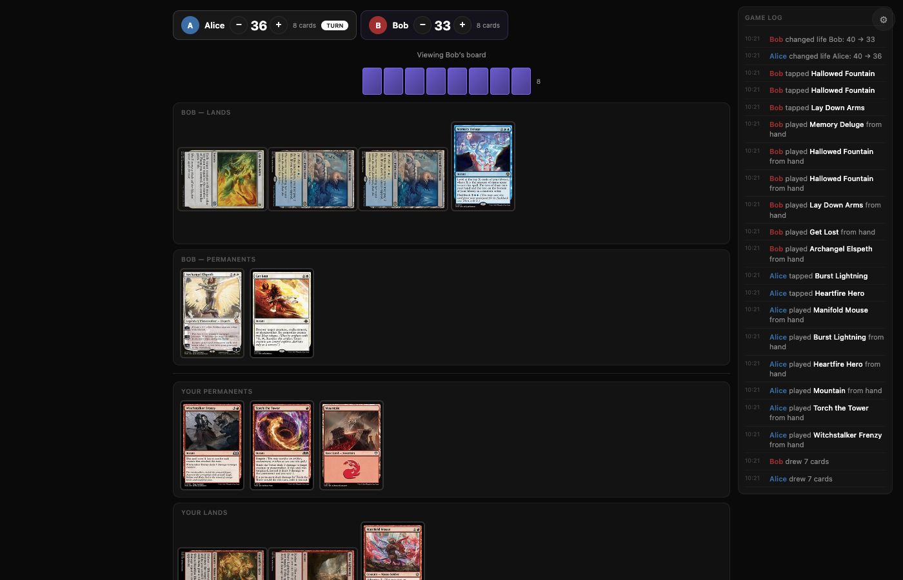
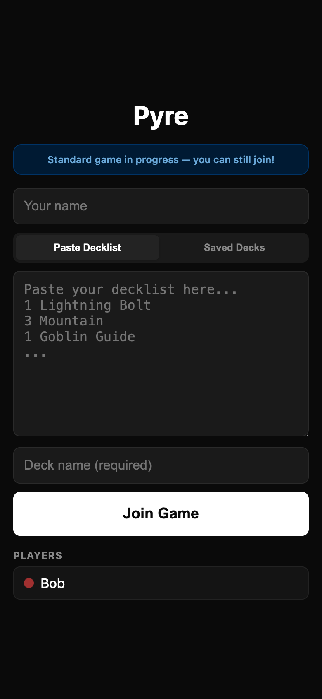

# Pyre

### Multiplayer Magic: The Gathering on any device.

Start a server, share the link, paste your decklists, and play Magic together — from your phone, tablet, or laptop. No installs, no accounts, no rules enforcement. Just a digital tabletop that gets out of your way.

<!--

-->

---

## How It Works

```
1. Host runs npm start
2. Friends connect via the LAN URL — phone, tablet, anything
3. Pick a mode: Standard, Commander, or Sealed Draft
4. Paste decklists or crack packs
5. Play Magic
```

---

## Features

### Play Any Format

**Standard** — Paste a decklist and go. Supports Moxfield, Archidekt, MTGO, and Arena formats.

**Commander** — Command zone with tax tracking, commander damage matrix across all opponents, and 40-life starting totals. Works with 2-8 players.

**Sealed Draft** — Open real boosters from any MTG set. Build a 40-card deck with sorting tools and basic lands. Then play.

<!--

-->

### Designed for Phones

Pyre is built touch-first. The entire UI is designed for phones and tablets — not adapted from desktop as an afterthought.

- **Tap any card to preview** — zoomed view with context-aware quick actions (Play, Tap, Discard, Exile)
- **Compact player bar** — opponent info at the top, your life total above your hand
- **Commander strips** — collapsible command zone with tax and damage tracking
- **44px minimum touch targets** — every button is finger-friendly
- **Works on iOS Safari** — automatic HTTP polling fallback when WebSocket is unavailable

<!--

-->

### Dark Mode

OLED-friendly dark theme by default. Card art pops against the black background. Toggle to light mode in settings.

<!--

-->

### Real-Time Multiplayer

All game state lives on the server. Every action is broadcast instantly to all players. Drop off WiFi and come right back — your seat is held for 10 minutes.

- **Any number of players** — 1v1, 4-player Commander, 8-player chaos
- **Cross-device** — iPhone vs. laptop vs. Android tablet, all in the same game
- **Game log** — every action logged with timestamps and player colors
- **Reconnection** — session tokens in localStorage, automatic rejoin

### Card Art from Scryfall

Every card rendered with real art from the Scryfall API. Double-faced cards flip with animation. Hover (desktop) or tap (mobile) to preview any card at full size.

### Sealed Draft

Open packs with a satisfying multi-phase animation — glow, tear, and card fan-out. Build your deck with 5 sort modes (color, type, CMC, rarity, name), add basic lands with mana pip tiles, name your deck, and jump into a game.

<!--

-->

### Everything You Need, Nothing You Don't

- **Tap/untap** cards with a tap
- **Life totals** with +/- buttons and flash animations
- **Counters** — +1/+1 counters on any permanent
- **Zone management** — browse graveyard, exile, library with multi-select
- **Library search** — find cards alphabetically, take to hand or reveal
- **Drag-and-drop** — move cards between zones on any device (long-press on touch)
- **Saved decks** — name your decks, reuse them later
- **New Game** — vote to restart from settings, everyone goes back to the lobby

---

## Quick Start

```bash
npm install    # one dependency: ws
npm start      # prints a LAN URL
```

Share the URL with your group. That's it.

---

## Tech

- **Server:** Node.js + `ws` (WebSocket) with HTTP long-polling fallback
- **Client:** Vanilla HTML/CSS/JS — zero external dependencies, no build step
- **Cards:** Scryfall API for card data and art
- **Rendering:** DOM reconciliation for smooth card animations
- **Theme:** CSS custom properties with dark/light toggle

---

*Pyre is a free-form digital tabletop, not a digital judge. Play however you want — just like paper.*
