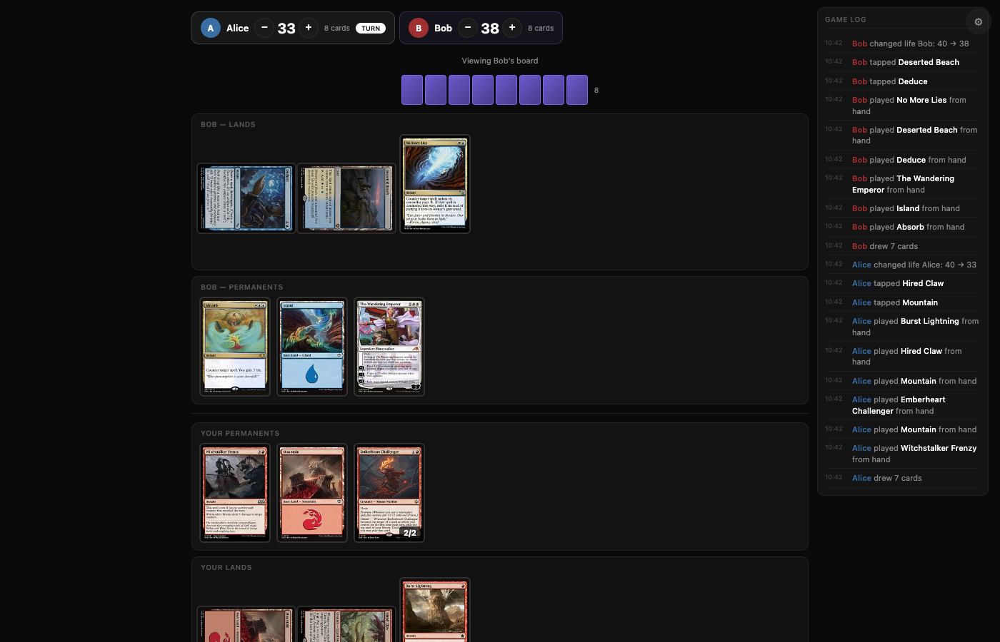
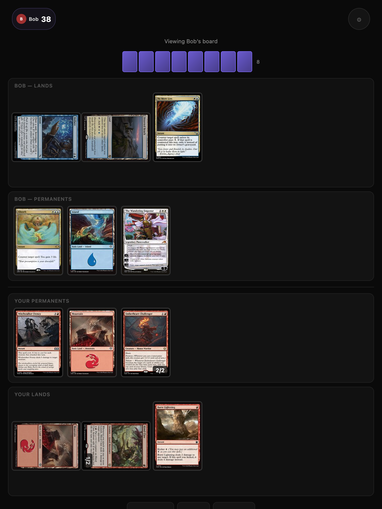
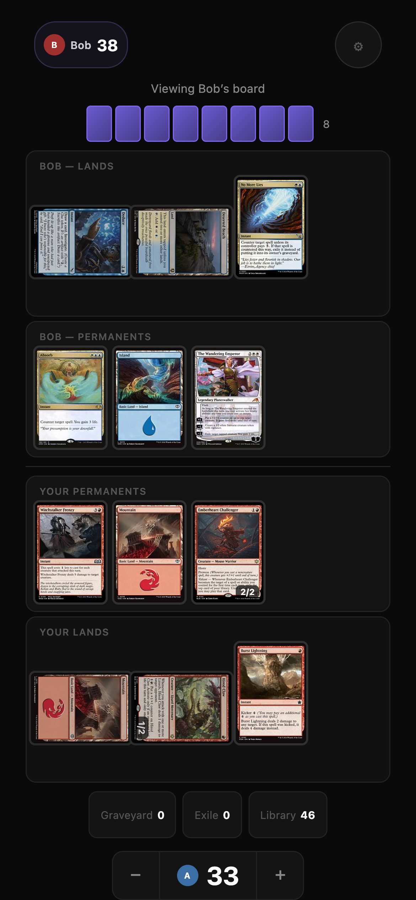
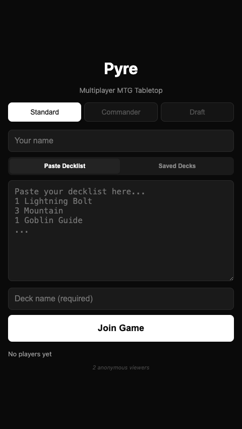
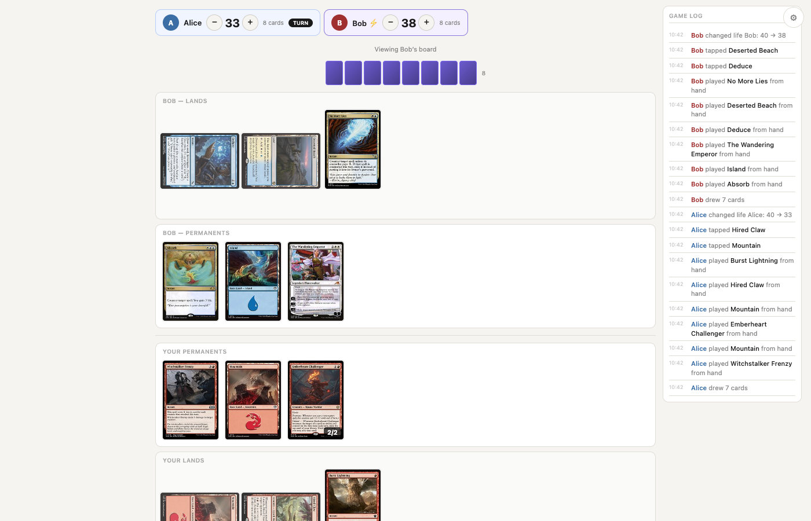

<div align="center">

# Pyre

**Multiplayer Magic: The Gathering on any device.**

Start a server, share the link, paste your decklists, play Magic.
No installs. No accounts. No rules enforcement. Just a digital tabletop.

</div>



## Works Everywhere

Pyre is designed to work on every screen size — from a 27" monitor to an iPhone SE.

| Desktop | Tablet | Phone |
|:-------:|:------:|:-----:|
|  |  |  |
| Full board + game log sidebar | Compact player bar, touch-optimized | Life controls at thumb, cards wrap |

---

## Get Started in 30 Seconds

```bash
npm install    # one dependency: ws
npm start      # prints a LAN URL — share it
```

That's it. Friends connect from any browser.

---

## Three Ways to Play

**Standard** — Paste a decklist from Moxfield, Archidekt, MTGO, or Arena and go.

**Commander** — 40 life, command zone with tax tracking, commander damage across all opponents. 2–8 players.

**Sealed Draft** — Crack real boosters from any MTG set. Build a 40-card deck with sorting tools and basic lands. Then play.



---

## Dark & Light

OLED-friendly dark theme by default. Card art pops. Toggle to light in settings.

| Dark | Light |
|:----:|:-----:|
|  |  |

---

## Built for Touch

Every interaction is designed for fingers first, adapted to mouse second.

- **Tap to preview** — see any card zoomed with quick actions (Play, Tap, Discard)
- **Long-press to drag** — move cards between zones on any device
- **44px touch targets** — every button meets accessibility minimums
- **iOS Safari** — automatic HTTP polling fallback when WebSocket drops

## Everything Else

- **Real-time multiplayer** via WebSockets — any number of players
- **Card art from Scryfall** — every card rendered with real art
- **Double-faced cards** — flip with 3D animation
- **Reconnection** — drop off WiFi, come right back. Seat held for 10 minutes
- **Game log** — every action timestamped with player colors
- **Zone management** — browse graveyard, exile, library with multi-select
- **Library search** — find cards alphabetically, take to hand or reveal
- **Counters** — +1/+1 on any permanent
- **Saved decks** — name and reuse across games
- **Pack opening** — glow, tear, and card fan-out animation
- **New Game** — vote to restart from settings

---

## Tech

| | |
|-|-|
| **Server** | Node.js + `ws` with HTTP long-polling fallback |
| **Client** | Vanilla HTML/CSS/JS — zero dependencies, no build step |
| **Cards** | Scryfall API |
| **Rendering** | DOM reconciliation for smooth card animations |
| **Theme** | CSS custom properties, dark/light toggle |

---

<div align="center">
<i>Pyre is a free-form digital tabletop, not a digital judge.<br>Play however you want — just like paper.</i>
</div>
